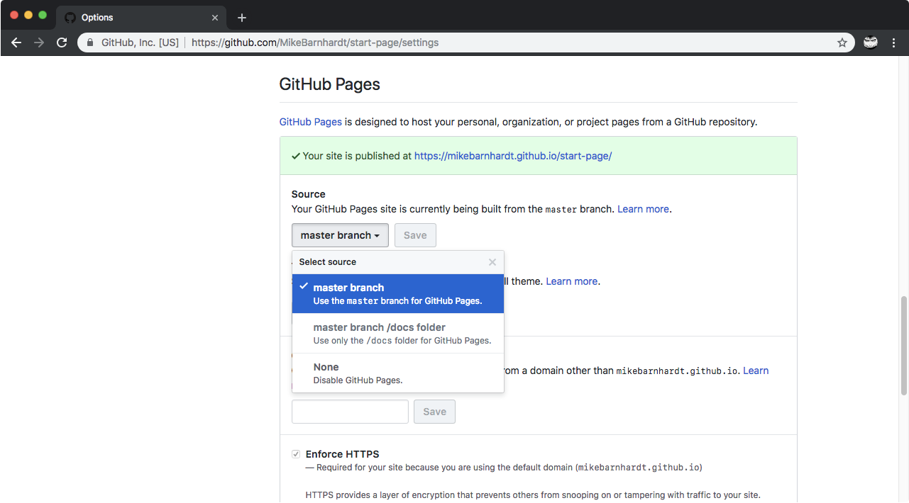

A custom browser start and new tab redirect page. Feel free to fork and edit!

# Themes

Themes are now supported through the URL query parameter `theme`. Just add `?theme=__theme_name__` at the end of your new tab URL.

> Example: `https://mikebarnhardt.github.io/start-page?theme=vanilla`

## Adding Themes

Create a new class beginning with `.theme-` and assign colors to the theme variables.

```css
:root {
	/* Default theme variables... */
}

.theme-vanilla {
	--background-color: #fdfbf9;
	--background-color-subtle: #f8f1f3;

	--text-color: #957595;
	--text-color-subtle: #d3bfd3;

	--primary-color: #33b1f9;
	--primary-color-subtle: #537bd9;

	--secondary-color: #f39d97;
	--secondary-color-subtle: #d37d97;

	--font-size: 20px;
}
```

In your new tab redirect settings just set `?theme=` to whatever your theme was named.

# Installing

## Chrome

Chrome does not support a custom new tab page out-of-the-box. I use [New Tab Redirect](https://chrome.google.com/webstore/detail/new-tab-redirect/icpgjfneehieebagbmdbhnlpiopdcmna) and point it to this repository's [GitHub Pages](https://pages.github.com/) (see below).

## Set up with GitHub Pages

* Fork this repository
* Go to your repository's Settings
* Scroll down to GitHub Pages and select `master branch` under Source



# Browser Support

I use CSS variables which is supported by the following:

* Chrome 49+
* Firefox 31+
* Edge 16+
* Safari 9.1+
* iOS Safari 9.3+
* Opera 36+
* Chrome for Android
* Firefox for Android

You can fork this repository and put in manual color values if you are using Internet Explorer (or just download a decent browser).

**Theme Browser Support**

Check if your browser supports [URLSearchParams](https://caniuse.com/#feat=urlsearchparams) (hint: it's not IE!).
